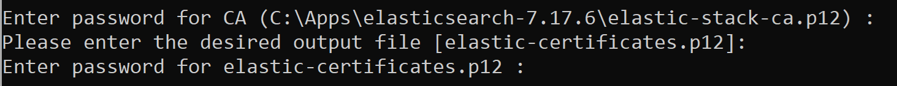

# Elastic and Kibana Install (Windows)

This guide walks through the steps to set up a single node Elasticsearch cluster and an instance of Kibana. It should take around 2 hours to complete the Elastic and Kibana install.&#x20;

If you are setting up a production environment, you will want to set up an Elasticsearch cluster. More information on this can be found on the ElasticSearch website.


The Elastic token needed to configure Kibana is only valid for 30 minutes. Once Elastic has been extracted you have 30 minutes to Install and Configure Kibana. 
It is not a long process but it's important you have that time to complete these steps.


<details>

<summary>Prerequisites</summary>

* Check what version of Elastic and Kibana is needed for the Aiimi Insight Engine vesion you are deploying. You can find this  in the release notes for your distribution.&#x20;
* Obtain your XPack Elasticsearch licence (or you can enable a trial).
* Install [Notepad++](https://notepad-plus-plus.org/) or similar text editing software.

</details>

<details>

<summary>PowerShell Hint</summary>

Your PowerShell will continue to auto scroll down as the process remains running. \
If you select and highlight a section of the prompt window the auto scroll will stop. This will make it easier to find your password and token.&#x20;

</details>

***

## Folder Structure Set Up

A specific folder structure is needed for the installation of Elasticsearch and Kibana. You can create this structure using a PowerShell query or manually.



To create these folders using PowerShell run the following script in an admin PowerShell.


Check the storage path in this script before running it. For example: (C:\\).



```powershell
mkdir C:\Apps;
mkdir C:\InsightMaker;
mkdir C:\Downloads;
mkdir C:\Utils
```




***

## Download Software



Download the InsightEngine zip file from the GitHub area and put it in the Downloads folder you created.

* If you do not have access to this reach out to your Aiimi contact.



Right click PowerShell and select Run as Administrator.



Copy the following script into the PowerShell to download the the additional software needed for Elastic and Kibana.


Check the storage path and release names match the required version before running this script. For example: (C:\\), (elasticsearch-8.17.3).



```powershell
Start-BitsTransfer -Source "https://nssm.cc/release/nssm-2.24.zip" -destination "C:\Downloads";
Start-BitsTransfer -Source "https://github.com/notepad-plus-plus/notepad-plus-plus/releases/download/v8.4.9/npp.8.4.9.Installer.x64.exe" -destination "C:\Downloads";
Start-BitsTransfer -Source "https://www.7-zip.org/a/7z2201-x64.exe" -destination "C:\Downloads";
Start-BitsTransfer -Source "https://artifacts.elastic.co/downloads/elasticsearch/elasticsearch-8.17.3-windows-x86_64.zip" -destination "C:\Downloads";
Start-BitsTransfer -Source "https://artifacts.elastic.co/downloads/kibana/kibana-8.17.3-windows-x86_64.zip" -destination "C:\Downloads"
```




Go to your downloads folder and check the files have downloaded.

* 7-Zip
* Elasticsearch
* Kibana
* Notepad ++
* NSSM

<figure><figcaption></figcaption></figure>



### Extract Software



Extract Elastic, Kibana, NSSM and Insight Engine zip files by running the following script in an admin PowerShell


Check the storage path and release names match the required version before running this script. For example: (C:\\), (elasticsearch-8.17.3).


<pre class="language-powershell" data-overflow="wrap" data-line-numbers><code class="lang-powershell">Expand-Archive -Force C:\Downloads\elasticsearch-8.17.3-windows-x86_64.zip C:\Apps;
Expand-Archive -Force C:\Downloads\Kibana-8.17.3-windows-x86_64.zip C:\Apps;
Expand-Archive -Force C:\Downloads\nssm-2.24.zip C:\Utils;
<strong>Expand-Archive -Force C:\Downloads\insightengine-win.2025.5.7.zip C:\InsightMaker
</strong></code></pre>



Check the files have extracted to the correct locations.

* Elasticsearch is in the Apps folder.&#x20;
* Kibana is in the Apps folder.
* NSSM is in the Utils folder.&#x20;
* There should be 13 folders within the Insight Maker folder.



***

## Configure Elastic

There are a number of configuration that need to be updated in the Elastic config file. This ensures the different paths match your system.



Running the following script in an admin PowerShell to update these.


Check the storage path and release names match the required version before running this script. For example: (C:\\), (elasticsearch-8.17.3).



```powershell
$Filename = "C:\Apps\elasticsearch-8.17.3\config\elasticsearch.yml";
((Get-Content -path $Filename -Raw) -replace '#cluster.name: my-application','cluster.name: ') | Set-Content -Path $Filename;
((Get-Content -path $Filename -Raw) -replace '#node.name:','node.name:') | Set-Content -Path $Filename;
((Get-Content -path $Filename -Raw) -replace '#path.data: /path/to/data','path.data: C:\Apps\Data') | Set-Content -Path $Filename;
((Get-Content -path $Filename  -Raw) -replace '#path.logs: /path/to/logs','path.logs: C:\tmp\logs') | Set-Content -Path $Filename;
((Get-Content -path $Filename -Raw) -replace '#network.host: 192.168.0.1','network.host: 0.0.0.0') | Set-Content -Path $Filename;
((Get-Content -path $Filename -Raw) -replace '#discovery.seed_hosts:','discovery.seed_hosts:') | Set-Content -Path $Filename;
((Get-Content -path $Filename -Raw) -replace 'host1','0.0.0.0') | Set-Content -Path $Filename;
((Get-Content -path $Filename -Raw) -replace ', "host2"','') | Set-Content -Path $Filename;
((Get-Content -path $Filename -Raw) -replace '#cluster.initial_master_nodes:','cluster.initial_master_nodes:') | Set-Content -Path $Filename;
((Get-Content -path $Filename -Raw) -replace ', "node-2"]',']')  | Set-Content -Path $Filename
```




***

## Install Elastic



Install Elastic as a service by running the following PowerShell script in a new admin PowerShell.


Check the storage path and release names match the required version before running this script. For example: (C:\\), (elasticsearch-8.17.3).



```powershell
cd C:\Apps\elasticsearch-8.17.3;
.\bin\elasticsearch.bat 
```


<mark style="color:red;">Do not close PowerShell when this script has finished.</mark>



This will return a password for Elastic. Make a note of this for later.



It will also return a token needed for the Kibana install. Make a note of this for later.

<figure><figcaption></figcaption></figure>



### Test Install



Test if your install worked by opening a web browser and navigating to https://localhost:9200.



Login in using the username 'elastic' and the password from PowerShell.

* It should show a block of code that contains build details. It should include, Build\_flavour, build\_type, build\_hash, etc.

<figure><figcaption></figcaption></figure>



***

## Install Kibana



Install Kibana by running the following PowerShell script in a new admin PowerShell.


Check the storage path and release names match the required version before running this script. For example: (C:\\), (elasticsearch-8.17.3).



```powershell
cd C:\Apps\kibana-8.17.3\bin;
.\kibana.bat
```


* <mark style="color:red;">Do not close PowerShell when this script has finished.</mark>



Once this has finished running a URL will appear. Navigate to that URL in your browser.&#x20;



Copy the token you got from the Elastic PowerShell.



Paste it into the Enrolment token in the Kibana session.



Select Configure Elastic.

* The configuration may not complete. That's not an issue at this point.



In your web browser, navigate to http://localhost:5601.



Use the Elastic credentials you used earlier to login.&#x20;



***

## Update Elastic License



Copy the text of your Elastic license into a Notepad++ file.





Save this file as Dev-license.json in the root folder.



Within http://localhost:5601 navigate to the Management tab on the left and select Elastic License Management.



Upload the Dev-license.json file to Kibana via the license manager.&#x20;

* It is normal for this to cause an access issue in Kibana. If it doesn't, check that Elastic hasn't previously been installed in 'Programs and Features' (and remove it if it's present).

<figure><figcaption></figcaption></figure>



***

## Create Elastic Certificate



Open another new PowerShell as an Admin.&#x20;

* This should be the third PowerShell you have open.



### Create the CA Cert



Create an Elastic ca cert by running the following script in the admin PowerShell.


Check the storage path and release names match the required version before running this script. For example: (C:\\), (elasticsearch-8.17.3).



```powershell
cd C:\Apps\elasticsearch-8.17.3\bin;
.\elasticsearch-certutil ca
```




When prompted for an output file, leave this empty and press Enter.

* If asked if you want to overwrite the existing file, type Y and press enter.



When prompted for the CA password enter a secure password.

* This password cannot include any special characters.



### Create the Certificate



Create an Elastic certificate by running the following Script.


Check the storage path and release names match the required version before running this script. For example: (C:\\), (elasticsearch-8.17.3).



```powershell
./elasticsearch-certutil cert -ca C:\Apps\elasticsearch-8.17.3\elastic-stack-ca.p12;
```




When prompted enter the CA password you just created.



When prompted for an output file, leave this empty and press Enter.



When prompted enter a password for this certificate.

* This password cannot include any special characters and should be different to the CA password.

<figure><figcaption></figcaption></figure>



### Copy Certificates



Create a new folder and move the certificates to it by running the following script.


Check the storage path and release names match the required version before running this script. For example: (C:\\), (elasticsearch-8.17.3).



```powershell
mkdir C:\Apps\certs;

copy-item C:\Apps\elasticsearch-8.17.3\*.p12 -Destination C:\Apps\certs

move C:\Apps\elasticsearch-8.17.3\*.p12 C:\Apps\elasticsearch-8.17.3\config\certs
```




***

## Secure Connection Configuration

To use Xpack security a number of configurations need to be updated. This improves the security between Kibana and Elastic.



To make these changes run the following script to make these changes automatically.


Check the storage path and release names match the required version before running this script. For example: (C:\\), (elasticsearch-8.17.3).



```powershell
$Filename="C:\Apps\elasticsearch-8.17.3\config\elasticsearch.yml";

((Get-Content -path $Filename -Raw) -replace 'http.p12','elastic-certificates.p12') | Set-Content -Path $Filename

((Get-Content -path $Filename -Raw) -replace 'transport.p12','elastic-certificates.p12') | Set-Content -Path $Filename;

((Get-Content -path $Filename -Raw) -replace '#action.destructive_requires_name: false','action.destructive_requires_name: true') | Set-Content -Path $Filename;

(Get-Content -path $Filename) | ? {$_.trim() -ne "" } | set-content $Filename
```




***

## Setup Elastic Keystore

The certificate password is used in a number of places and needs to be updated to match the certificate password you set.



Run the following scripts one by one to update the passwords.


Check the storage path and release names match the required version before running this script. For example: (C:\\), (elasticsearch-8.17.3).



```powershell
cd C:\Apps\elasticsearch-8.17.3\bin;
.\elasticsearch-keystore add xpack.security.transport.ssl.keystore.secure_password
```




If asked if you want to overwrite the existing file, type Y and press enter.



When prompted enter the Certificate password.



Run the next script.


```powershell
.\elasticsearch-keystore add xpack.security.transport.ssl.truststore.secure_password
```




If asked if you want to overwrite the existing file, type Y and press enter.



When prompted enter the Certificate password.



Run the next script.


```powershell
.\elasticsearch-keystore add xpack.security.http.ssl.keystore.secure_password
```




If asked if you want to overwrite the existing file, type Y and press enter.



When prompted enter the Certificate password.



Run the next script.


```powershell
.\elasticsearch-keystore add xpack.security.http.ssl.truststore.secure_password
```




When prompted enter the Certificate password.



***

## Configure Secure Connection



Update the kibana.yml file by running the following script.


Check the storage path and release names match the required version before running this script. For example: (C:\\), (kibana-8.17.3).



```powershell
$Filename="C:\Apps\Kibana-8.17.3\config\kibana.yml";

((Get-Content -path $Filename -Raw) -replace '#elasticsearch.ssl.verificationMode: full','elasticsearch.ssl.verificationMode: none') | Set-Content -Path $Filename
```




You can now close the Elastic and Kibana PowerShell consoles.

1. Within each console press Ctrl + C.
2. It will then ask if you want to terminate the session. Enter Y to confirm.

<figure><figcaption></figcaption></figure>



***

## Install Elastic Service


Check the storage path and release names match the required version before running this script. For example: (C:\\), (elasticsearch-8.17.3).




Run the following command in PowerShell to install the Elastic Service.


```powershell
C:\Apps\elasticsearch-8.17.3\bin\elasticsearch-service.bat install
```




Run the following command to start the elastic service.


```powershell
C:\Apps\elasticsearch-8.17.3\bin\elasticsearch-service.bat start
```




Open your web browser and navigate to https://localhost:9200.

* This may take a few minutes to load for the first time.



Login using the Elastic credentials.



***

## Install Kibana Service



Run the following command in PowerShell to install the Kibana Service.


Check the storage path and release names match the required version before running this script. For example: (C:\\), (nssm-2.24).



```powershell
C:\Utils\nssm-2.24\win64\nssm.exe install insightenginekibana
```




Select the ... browse button in the top bar.



Go to Apps > Kibana > Bin and select Kibana.



Select Install Service.



Run the following command in PowerShell to start the Kibana service.


```powershell
C:\Utils\nssm-2.24\win64\nssm.exe start "insightenginekibana"
```




Open your web browser and navigate to http://localhost:5601.

* This may take a few minutes to load the first time.



Login using the Elastic credentials.


